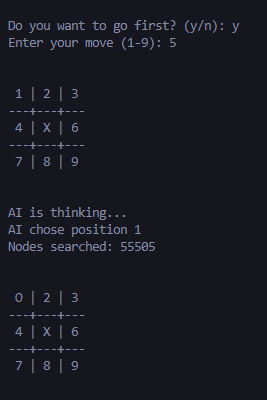
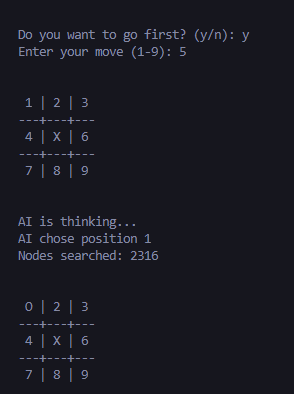

# Tic - Tac - Toe Activity
### Name: Allan John I. Funelas
### Submitted: 18/10/2025

This repository is an AI related activity, where in we implemented some of the decision methods of Artificial Intelligence, namely Minimax and Alphabeta Pruning. 

### What is Minimax?
- Based on this activity and ChatGPT I have learned that this algorithm is a brute-force method where it checks every branches and nodes of the current possible moves in the board. Just like how it was coded, it runs recursively on each tile in the board and returns the best possible move according to the consequent nodes that this move will be making in the next turn. In short, this simulates all the possible moves that will happen on the board and chooses the best node that is closer to the goal (which is winning).

### What is Alphabeta?
- Alphabeta Pruning Algorithm in the other hand runs in the same way like the Minimax, which simulates possible moves, but instead of checking all of them, Alphabeta stores a current best move, and if it sees a node which already does not help in achieving the goal, it will automatically ignore this node and its respective branches. This process significantly lowers the number of nodes that is checked by the machine, which therefore lessens the runtime and 'thinking' time of the AI. This is shown in the attached screenshot below.

#### Minimax Result

#### AlphaBeta Result

- We can see that Alphabeta has a much significantly lower nodes that has been searched compared to Minimax, which shows the efficiency of Alphabeta when it comes to searching the best node.

### Challenges Met In This Activity
- While running the code I have encountered difficulty in identifying the respective numbers for each tile in the board, that's why I implemented a number system on it. Also it is hard to compare the runtime of both of them since they both run in under a second, I implemented a node count for each iteration that it makes, making it easier to compare. In addition to that, the very concept of Minimax and Alphabeta is still kind of hard to digest and fully comprehend, but so far I was able to scratch the surface of it with the help of ChatGPT's explanation on it.